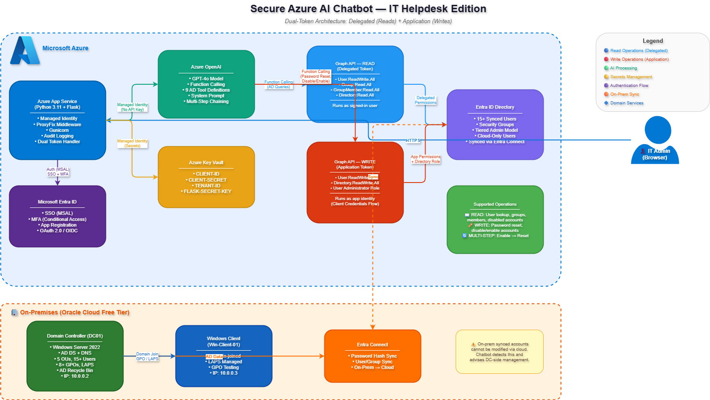

# 🤖 Secure Azure AI Chatbot

An enterprise-grade AI chatbot built with Azure OpenAI, secured with Microsoft Entra ID authentication, Azure Key Vault, and Managed Identity — implementing Zero Trust security principles.



## 🎯 Project Overview

This project demonstrates how to build a production-ready AI application with enterprise security controls. The chatbot uses GPT-4o for intelligent conversations while implementing multiple layers of security.

### Key Features

- 🤖 **AI-Powered Chat** — Azure OpenAI (GPT-4o) for intelligent responses
- 🔐 **Enterprise Authentication** — Microsoft Entra ID with OAuth 2.0/OIDC
- 🛡️ **MFA Enforcement** — Conditional Access policy requires multi-factor authentication
- 🔑 **Secrets Management** — Azure Key Vault (no secrets in code)
- 🆔 **Passwordless Azure Auth** — Managed Identity (no API keys)
- 📝 **Audit Logging** — All user actions logged with timestamps
- 🔒 **HTTPS Only** — Enforced secure communication
- 🛡️ **Security Headers** — HSTS, X-Frame-Options, CSP protection

## 🏗️ Architecture
```
┌─────────────────────────────────────────────────────────────────────────────┐
│                              AZURE ENVIRONMENT                              │
├─────────────────────────────────────────────────────────────────────────────┤
│                                                                             │
│    ┌──────────┐         ┌─────────────────┐         ┌───────────────────┐   │
│    │          │  Login  │                 │  Token  │                   │   │
│    │   USER   │────────▶│   ENTRA ID      │───────▶│   APP SERVICE     │   │
│    │          │         │                 │         │   (Python/Flask)  │   │
│    └──────────┘         │  • OAuth 2.0    │         │                   │   │
│                         │  • MFA (CA)     │         └─────────┬─────────┘   │
│                         │  • Audit Logs   │                   │             │
│                         └─────────────────┘                   │             │
│                                                               │             │
│    ┌─────────────────┐                           ┌───────────▼─────────┐    │
│    │                 │    Managed Identity       │                     │    │
│    │   KEY VAULT     │◀─────────────────────────│   AZURE OPENAI      │     │
│    │                 │    (No API Keys!)         │   (GPT-4o)          │    │
│    │  • Client ID    │                           │                     │    │
│    │  • Client Secret│                           └─────────────────────┘    │
│    │  • Tenant ID    │                                                      │
│    └─────────────────┘                                                      │
│                                                                             │
│    ZERO TRUST PRINCIPLES:                                                   │
│    ✓ Verify explicitly (authenticate every request)                         │
│    ✓ Least privilege (scoped permissions, app roles)                        │
│    ✓ Assume breach (comprehensive audit logging)                            │
│                                                                              │
└──────────────────────────────────────────────────────────────────────────────┘
```
## 🔐 Security Controls

| Control | Implementation | Purpose |
|---------|----------------|---------|
| **Authentication** | Entra ID (OAuth 2.0/OIDC) | Verify user identity |
| **Multi-Factor Auth** | Conditional Access Policy | Prevent credential theft |
| **Secrets Management** | Azure Key Vault | No secrets in code |
| **Passwordless Auth** | Managed Identity | No API keys to Azure services |
| **Authorization** | App Roles (ChatUser, ChatAdmin) | Role-based access |
| **Transport Security** | HTTPS Only | Encrypted communication |
| **Security Headers** | HSTS, X-Frame-Options, CSP | Browser-level protection |
| **Audit Logging** | All actions logged | Incident investigation |

## 🛡️ Zero Trust Implementation

### 1. Verify Explicitly
- Every request requires valid Entra ID token
- Token validated on each API call
- MFA enforced via Conditional Access
- Session management with secure cookies

### 2. Least Privilege
- Users must be explicitly assigned to the application
- App roles control access levels (ChatUser vs ChatAdmin)
- Minimal API permissions (User.Read only)
- Managed Identity has only required Azure RBAC roles

### 3. Assume Breach
- All login attempts logged with timestamps
- Chat inputs and outputs logged for audit
- Security headers prevent common attacks
- HTTPS enforced to prevent interception

## 🚀 Technologies Used

| Category | Technology |
|----------|------------|
| **AI** | Azure OpenAI (GPT-4o) |
| **Backend** | Python 3.11, Flask |
| **Authentication** | Microsoft Entra ID, MSAL |
| **Secrets** | Azure Key Vault |
| **Identity** | Managed Identity |
| **Hosting** | Azure App Service |
| **Security** | Conditional Access, OAuth 2.0, OIDC |

## 📜 Certifications Demonstrated

| Certification | Skills Applied |
|---------------|----------------|
| **SC-300** | App Registration, Conditional Access, MFA, OAuth 2.0 |
| **SC-100** | Zero Trust Architecture, Security Controls, Key Vault |
| **AZ-900** | Azure Services, App Service, Resource Management |

## 📸 Screenshots

| Screenshot | Description |
|------------|-------------|
| [Login Page](screenshots/01-login-page.png) | Secure login with Microsoft |
| [MFA Prompt](screenshots/02-mfa-prompt.png) | Conditional Access enforcing MFA |
| [Chat Interface](screenshots/03-chat-interface.png) | AI chat in action |
| [Key Vault](screenshots/04-key-vault-secrets.png) | Secrets management |
| [Managed Identity](screenshots/05-managed-identity.png) | Passwordless authentication |

## 🛠️ Local Development

### Prerequisites
- Python 3.11+
- Azure subscription
- Entra ID tenant

### Setup
```bash
# Clone repository
git clone https://github.com/Amogh-Karankal/azure-secure-ai-chatbot.git
cd azure-secure-ai-chatbot/app

# Create virtual environment
python -m venv venv
source venv/bin/activate  # On Windows: venv\Scripts\activate

# Install dependencies
pip install -r requirements.txt

# Configure environment
cp .env.example .env
# Edit .env with your Azure credentials

# Run application
python app.py
```

### Environment Variables (Local)
```
CLIENT_ID=your-entra-app-client-id
CLIENT_SECRET=your-client-secret
TENANT_ID=your-tenant-id
AZURE_OPENAI_KEY=your-openai-key
AZURE_OPENAI_ENDPOINT=https://your-resource.openai.azure.com/
AZURE_OPENAI_DEPLOYMENT=gpt-4o
FLASK_SECRET_KEY=your-random-secret-key
```
## ☁️ Azure Deployment

When deployed to Azure, the application uses:
- **Key Vault** for secrets (no environment variables with secrets)
- **Managed Identity** for Azure OpenAI (no API keys)

See [Setup Guide](docs/setup-guide.md) for detailed deployment instructions.

## 📁 Documentation

- [Architecture Overview](docs/architecture.md)
- [Security Controls](docs/security-controls.md)
- [Setup Guide](docs/setup-guide.md)
- [Troubleshooting](docs/troubleshooting.md)

## 🔮 Future Enhancements

- [ ] Streaming responses (text appears word-by-word)
- [ ] Chat history persistence with Azure Cosmos DB
- [ ] Azure WAF for additional protection
- [ ] Application Insights for monitoring
- [ ] Rate limiting per user

## 👤 Author

**Amogh Karankal**
- LinkedIn: [linkedin.com/in/amoghkarankal](https://linkedin.com/in/amoghkarankal)
- GitHub: [github.com/Amogh-Karankal](https://github.com/Amogh-Karankal)

## 📄 License

This project is licensed under the MIT License - see the [LICENSE](LICENSE) file for details.
