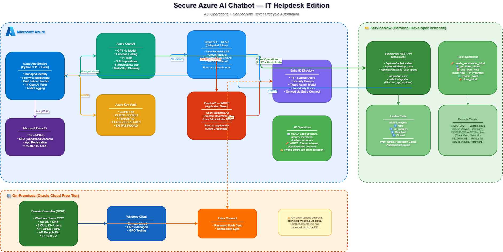

# 🤖 Secure Azure AI Chatbot — IT Helpdesk Edition

An enterprise-grade AI chatbot built with Azure OpenAI (GPT-4o), secured with Microsoft Entra ID authentication, Azure Key Vault, and Managed Identity — implementing Zero Trust security principles. Integrated with **Active Directory via Microsoft Graph API** to serve as an AI-powered IT Helpdesk assistant that queries live directory data synced from an on-premises AD environment.


## 🎯 Project Overview

This project demonstrates how to build a production-ready AI application with enterprise security controls. The chatbot uses GPT-4o for intelligent conversations while implementing multiple layers of security — and now serves as a functional **IT Helpdesk assistant** that queries real Active Directory data through Microsoft Graph API using OpenAI function calling.

### Key Capabilities

- **AI-Powered Chat** — Natural language conversations powered by Azure OpenAI (GPT-4o)
- **Active Directory Integration** — Queries live AD data (user accounts, group memberships, account status) via Microsoft Graph API
- **OpenAI Function Calling** — AI automatically decides when to query AD based on user questions
- **Entra ID Authentication** — Microsoft SSO with MFA via Conditional Access
- **Zero Trust Architecture** — No hardcoded secrets, Managed Identity for service-to-service auth
- **Audit Logging** — Every login, query, and AD lookup is logged

## 🏗️ Architecture



## 🔍 AD Integration — How It Works

The chatbot uses **OpenAI function calling** to automatically query Active Directory when users ask AD-related questions:

```
User: "Is john.smith's account enabled?"
  │
  ▼
Azure OpenAI analyzes the question
  │
  ▼
AI decides to call: get_user_info(username="john.smith")
  │
  ▼
App calls Microsoft Graph API with delegated token
  │
  ▼
Graph API returns real user data from Entra ID
  │
  ▼
AI formats the response in natural language
  │
  ▼
User sees: "Yes, John Smith's account is enabled."
```

### Supported AD Queries

| Query Type | Example | Function Called |
|-----------|---------|----------------|
| User lookup | "Is john.smith's account enabled?" | `get_user_info` |
| Group membership | "What groups is lisa.money in?" | `get_user_groups` |
| Group members | "Who are the members of Tier0-DomainAdmins?" | `get_group_members` |
| All users | "List all users in the directory" | `list_all_users` |
| All groups | "Show me all security groups" | `list_all_groups` |
| Disabled accounts | "Are there any disabled accounts?" | `get_disabled_users` |

### Graph API Permissions (Delegated)

| Permission | Purpose |
|-----------|---------|
| `User.Read` | Read signed-in user profile |
| `User.Read.All` | Read all user profiles |
| `Group.Read.All` | Read all groups |
| `GroupMember.Read.All` | Read group memberships |
| `Directory.Read.All` | Read directory data |

## 🔐 Security Controls

| Layer | Implementation |
|-------|---------------|
| **Authentication** | Microsoft Entra ID with MSAL |
| **MFA** | Conditional Access policy requiring MFA |
| **Secrets Management** | Azure Key Vault — no secrets in code |
| **Service Auth** | Managed Identity — no API keys for Azure services |
| **HTTPS Enforcement** | App Service HTTPS Only + ProxyFix middleware |
| **Security Headers** | X-Content-Type-Options, X-Frame-Options, HSTS, XSS Protection |
| **Graph API Scoping** | Delegated permissions only — queries run as the signed-in user |
| **Audit Logging** | Every login, chat message, and AD query logged with timestamps |
| **Session Management** | Server-side Flask sessions |
| **CSRF Protection** | State parameter validation on OAuth callbacks |

## 🔗 Connected AD Environment

This chatbot queries a live Active Directory environment synced via Entra Connect:

| Component | Details |
|-----------|---------|
| **Domain** | amoghlab.local |
| **Domain Controller** | Windows Server 2022 on Oracle Cloud |
| **Users** | 15+ synced users across IT, HR, Finance, Sales |
| **Groups** | Security groups including Tier0-DomainAdmins, IT_Admins, VPN_Users |
| **GPOs** | 8+ including fine-grained password policies, LAPS, loopback processing |
| **LAPS** | Windows LAPS deployed for local admin password management |
| **Tiered Admin Model** | Tier 0/1/2 privilege separation |
| **AD Lab Repo** | [Windows-AD-Lab](https://github.com/Amogh-Karankal/Windows-AD-Lab) |

## 📁 Project Structure

```
azure-secure-ai-chatbot/
├── app/
│   ├── app.py                 # Main Flask application (with ProxyFix)
│   ├── auth_config.py         # Local dev Entra ID configuration
│   ├── auth_config_azure.py   # Azure deployment config (Key Vault + MI)
│   ├── graph_helpers.py       # Graph API functions + OpenAI tool definitions
│   ├── requirements.txt       # Python dependencies
│   ├── templates/
│   │   ├── login.html         # Login page
│   │   └── chat.html          # Chat interface
│   └── static/
│       └── style.css          # UI styling
├── screenshots/               # Project screenshots
├── README.md
├── LICENSE
└── .gitignore
```

## 📸 Screenshots

| Screenshot | Description |
|-----------|-------------|
| Login page | Entra ID sign-in with live App Service URL |
| MFA prompt | Conditional Access enforcing multi-factor authentication |
| Chat interface | AI chatbot responding to general questions |
| AD user query | Chatbot checking if a user account is enabled |
| AD group query | Chatbot listing group memberships for a user |
| AD group members | Chatbot showing members of Tier0-DomainAdmins |
| All users list | Chatbot listing all directory users with status |

## 🚀 Deployment

### Prerequisites

- Azure subscription
- Azure OpenAI resource with GPT-4o deployment
- Microsoft Entra ID tenant with app registration
- On-premises AD synced via Entra Connect (for AD queries)

### Local Development

```bash
# Clone the repository
git clone https://github.com/Amogh-Karankal/azure-secure-ai-chatbot.git
cd azure-secure-ai-chatbot/app

# Create virtual environment
python -m venv venv
source venv/bin/activate  # Linux/Mac
venv\Scripts\activate     # Windows

# Install dependencies
pip install -r requirements.txt

# Configure environment variables (.env file)
CLIENT_ID=your-client-id
CLIENT_SECRET=your-client-secret
TENANT_ID=your-tenant-id
FLASK_SECRET_KEY=your-secret-key
AZURE_OPENAI_KEY=your-openai-key
AZURE_OPENAI_ENDPOINT=https://your-resource.openai.azure.com/
AZURE_OPENAI_DEPLOYMENT=gpt-4o

# Run the application
python app.py
```

### Azure App Service Deployment

1. Create App Service (Python 3.11)
2. Enable system-assigned Managed Identity
3. Create Azure Key Vault and store secrets (CLIENT-ID, CLIENT-SECRET, TENANT-ID, FLASK-SECRET-KEY)
4. Grant Managed Identity access to Key Vault (Key Vault Secrets User) and Azure OpenAI (Cognitive Services OpenAI User)
5. Configure App Service environment variables: `KEY_VAULT_NAME`, `AZURE_OPENAI_ENDPOINT`, `AZURE_OPENAI_DEPLOYMENT`
6. Set startup command: `gunicorn --bind=0.0.0.0 --timeout 600 app:app`
7. Enable HTTPS Only
8. Add redirect URI to app registration: `https://your-app.azurewebsites.net/getAToken`
9. Grant admin consent for Graph API permissions (User.Read.All, Group.Read.All, GroupMember.Read.All, Directory.Read.All)
10. Deploy code via VS Code Azure extension, ZIP deploy, or Kudu

### Troubleshooting

| Issue | Fix |
|-------|-----|
| AADSTS50011 redirect URI mismatch | Add exact URI from error to App Registration → Authentication |
| `http://` instead of `https://` in redirect URI | ProxyFix middleware is already included in `app.py` — ensure the updated version is deployed |
| Key Vault access denied | Grant Managed Identity the "Key Vault Secrets User" role |
| OpenAI access denied | Grant Managed Identity the "Cognitive Services OpenAI User" role |
| Container timeout on startup | Verify startup command, restart App Service |
| DeploymentNotFound (404) | Verify `AZURE_OPENAI_DEPLOYMENT` matches your model deployment name |

## 🛠️ Technologies

| Category | Technology |
|----------|-----------|
| **AI** | Azure OpenAI (GPT-4o), Function Calling |
| **Backend** | Python, Flask, Gunicorn |
| **Authentication** | Microsoft Entra ID, MSAL, Conditional Access |
| **Directory Integration** | Microsoft Graph API, Entra Connect |
| **Secrets** | Azure Key Vault, Managed Identity |
| **Hosting** | Azure App Service (B1) |
| **Proxy** | Werkzeug ProxyFix (HTTPS behind reverse proxy) |
| **Logging** | Python logging module (audit trail) |

## 📈 Future Enhancements

- Password reset via Graph API (self-service through chatbot)
- Account unlock functionality
- Azure Content Safety integration for input filtering
- RAG with IT knowledge base articles
- Ticket creation integration (ServiceNow / osTicket)

## 🔗 Related Projects

- **[Windows AD Lab](https://github.com/Amogh-Karankal/Windows-AD-Lab)** — On-premises Active Directory environment that syncs to this chatbot via Entra Connect

## 👤 Author

**Amogh Karankal**

- GitHub: [@Amogh-Karankal](https://github.com/Amogh-Karankal)
- LinkedIn: [Amogh Karankal](https://www.linkedin.com/in/amoghkarankal/)

## 📄 License

This project is licensed under the MIT License.

---

*Built as part of IT helpdesk and cybersecurity career development*
